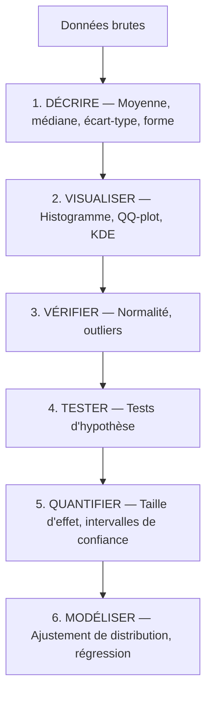
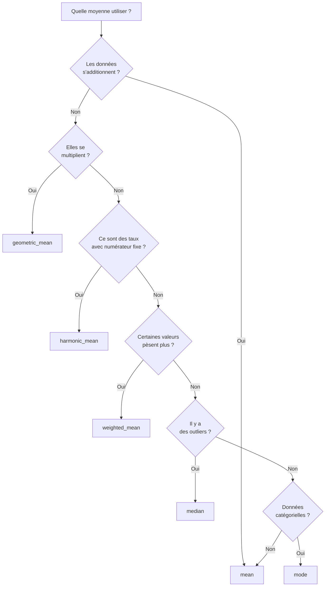
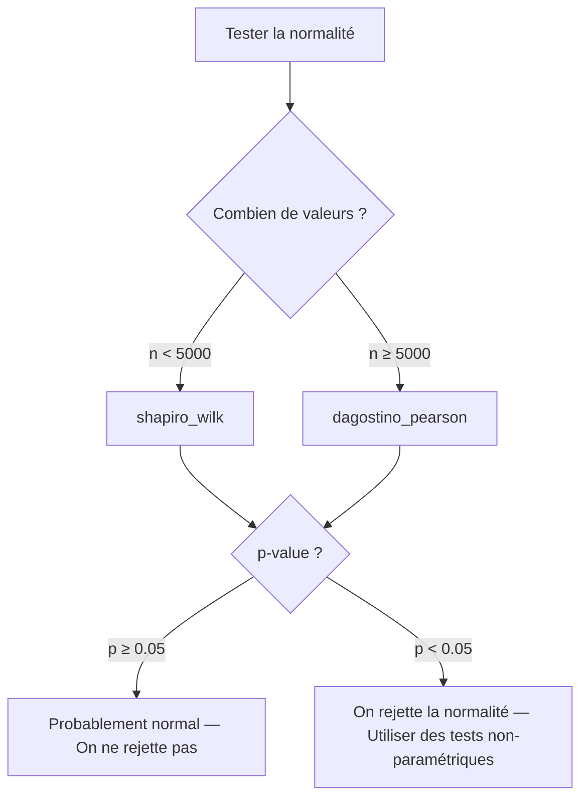
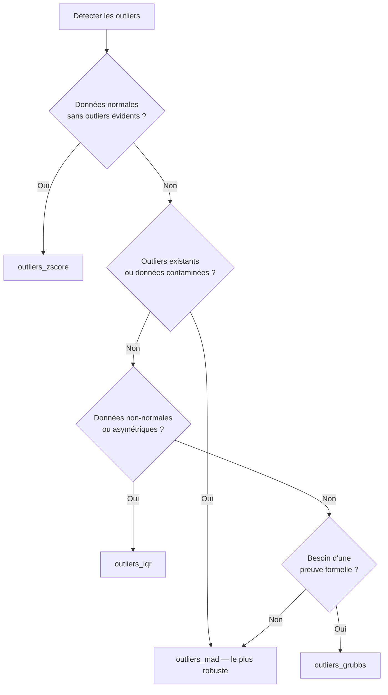
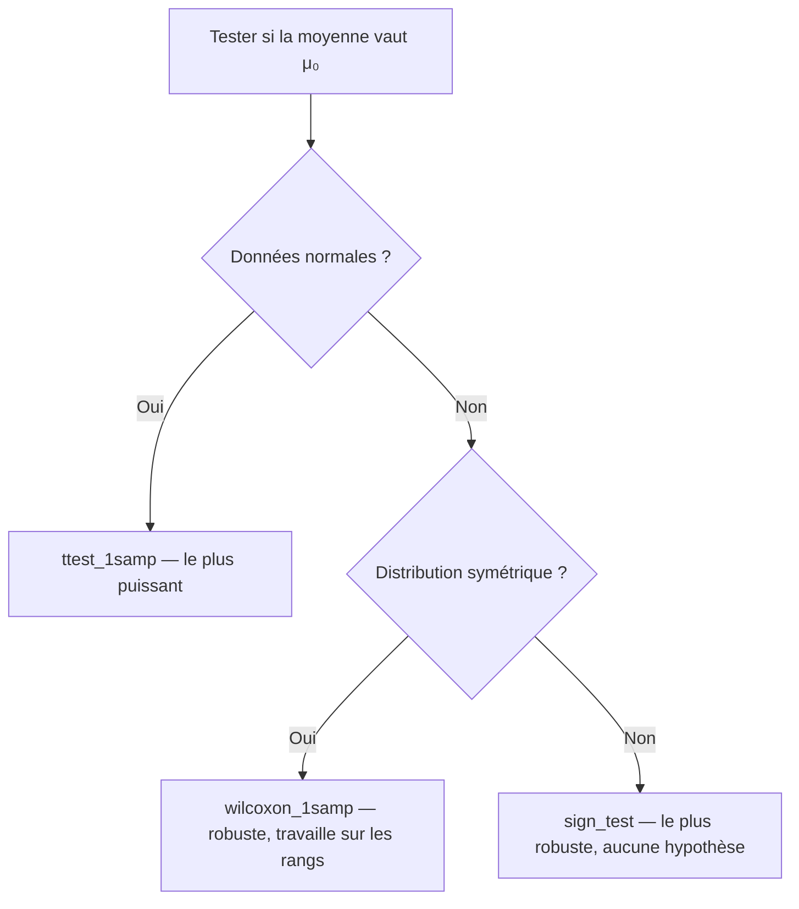
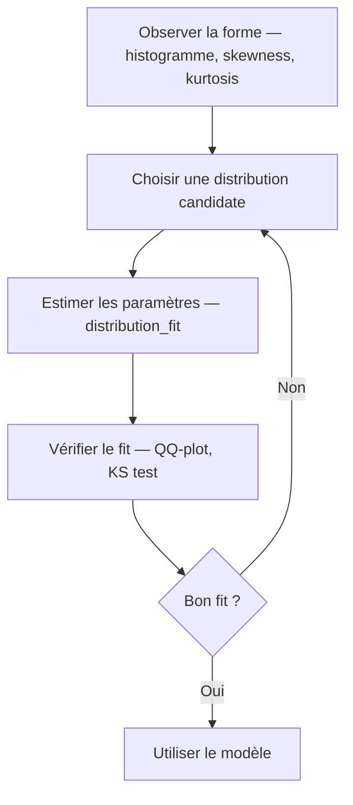
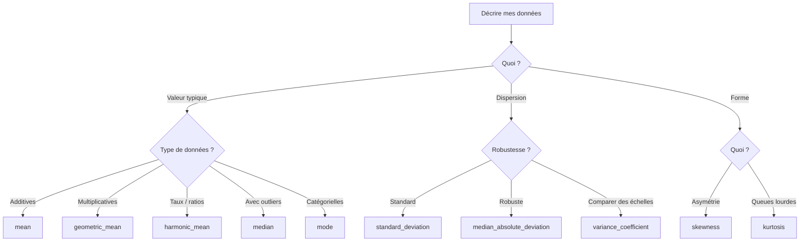
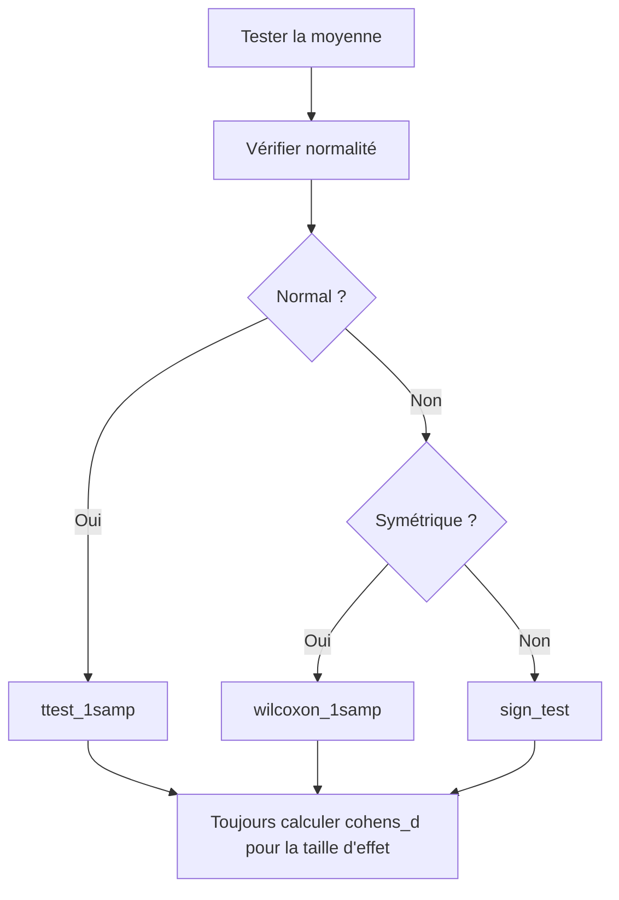

# Statistiques appliquées — Guide pratique

> Ce guide accompagne la lib `polars_stats`. Il couvre les fondamentaux dans l'ordre
> où tu en as besoin quand tu explores un jeu de données.

---

## Table des matières

1. [Le workflow statistique](#1-le-workflow-statistique)
2. [Étape 1 — Décrire les données](#2-étape-1--décrire-les-données)
3. [Étape 2 — Comprendre la forme (distribution)](#3-étape-2--comprendre-la-forme-distribution)
4. [Étape 3 — Tester la normalité](#4-étape-3--tester-la-normalité)
5. [Étape 4 — Détecter les outliers](#5-étape-4--détecter-les-outliers)
6. [Étape 5 — Tester une hypothèse](#6-étape-5--tester-une-hypothèse)
7. [Étape 6 — Mesurer la taille d'effet](#7-étape-6--mesurer-la-taille-deffet)
8. [Étape 7 — Estimer avec des intervalles de confiance](#8-étape-7--estimer-avec-des-intervalles-de-confiance)
9. [Étape 8 — Ajuster une distribution](#9-étape-8--ajuster-une-distribution)
10. [Arbre de décision — Quel test utiliser ?](#10-arbre-de-décision--quel-test-utiliser-)
11. [Glossaire](#11-glossaire)

---

## 1. Le workflow statistique

Quand tu reçois un jeu de données, l'analyse suit toujours le même ordre :



**Règle d'or** : ne jamais sauter à l'étape 4 sans avoir fait les étapes 1 à 3.
Un test d'hypothèse sur des données qu'on n'a pas explorées, c'est du pilotage à l'aveugle.

---

## 2. Étape 1 — Décrire les données

### Les mesures de tendance centrale

Ce sont les réponses à la question : **"Quelle est la valeur typique ?"**

#### Moyenne arithmétique (`mean`)

La somme divisée par le nombre de valeurs.

```
Données : [10, 20, 30, 40, 50]
Moyenne : (10 + 20 + 30 + 40 + 50) / 5 = 30
```

**Avantage** : utilise toute l'information.
**Défaut** : un seul outlier peut la tirer violemment.

```
Données : [10, 20, 30, 40, 500]
Moyenne : 120   ← ne représente personne
Médiane : 30    ← plus fidèle
```

#### Médiane (`median`)

La valeur du milieu quand on trie les données.

```
Données triées (n impair) : [10, 20, ►30◄, 40, 50]       → médiane = 30
Données triées (n pair)   : [10, 20, ►30, 40◄, 50, 60]   → médiane = (30+40)/2 = 35
```

**Avantage** : insensible aux outliers.
**Défaut** : ignore les valeurs extrêmes, même quand elles sont informatives.

**Règle pratique** : si `mean ≈ median`, la distribution est symétrique. Si elles divergent, il y a de l'asymétrie.

#### Mode (`mode`)

La valeur la plus fréquente.

```
Données : [1, 2, 2, 3, 3, 3, 4]
Mode    : 3 (apparaît 3 fois)
```

Seule mesure de tendance centrale qui fonctionne sur des données catégorielles ("la couleur la plus vendue est le bleu").

#### Moyenne géométrique (`geometric_mean`)

La moyenne adaptée aux **données multiplicatives** (taux de croissance, rendements).

```
Rendements annuels : +10%, -20%, +30%
Multiplicateurs    : [1.10, 0.80, 1.30]

Moyenne arithmétique : (1.10 + 0.80 + 1.30) / 3 = 1.067 → +6.7%  ← FAUX
Moyenne géométrique  : (1.10 × 0.80 × 1.30)^(1/3) = 1.046 → +4.6% ← CORRECT
```

**Utilise-la quand** : les données se multiplient entre elles (rendements, taux, ratios).

#### Moyenne harmonique (`harmonic_mean`)

La moyenne adaptée aux **taux avec numérateur fixe** (vitesses, prix unitaires).

```
Aller  : 60 km/h sur 120 km → 2h
Retour : 40 km/h sur 120 km → 3h
Total  : 240 km en 5h = 48 km/h

Moyenne arithmétique : (60 + 40) / 2 = 50 km/h   ← FAUX
Moyenne harmonique   : 2 / (1/60 + 1/40) = 48 km/h ← CORRECT
```

**Utilise-la quand** : le numérateur du ratio est fixe (même distance, même budget, même volume).

#### Moyenne pondérée (`weighted_mean`)

Chaque valeur a un poids différent.

```
Notes   : [12, 15, 8]
Coeffs  : [1,  3,  2]

Moyenne pondérée : (12×1 + 15×3 + 8×2) / (1+3+2) = 73/6 = 12.17
```

---

### Quand utiliser quelle moyenne ?



Et dans tous les cas : **moyenne arithmétique ≥ moyenne géométrique ≥ moyenne harmonique**
(pour des valeurs positives). C'est une propriété mathématique, pas un hasard.

---

### Les mesures de dispersion

Répondent à la question : **"Les données sont-elles resserrées ou étalées ?"**

#### Variance (`variance`) et écart-type (`standard_deviation`)

La variance mesure la distance moyenne au carré par rapport à la moyenne.
L'écart-type est sa racine carrée — il a la même unité que les données.

```
Données : [2, 4, 6, 8, 10]
Moyenne : 6

Écarts      : [-4, -2, 0, 2, 4]
Écarts²     : [16,  4, 0, 4, 16]
Variance    : (16+4+0+4+16) / (5-1) = 10
Écart-type  : √10 ≈ 3.16
```

**La règle des 68-95-99.7** (pour les données normales) :

| Plage | Proportion des données |
|---|---|
| μ ± 1σ | ~68% |
| μ ± 2σ | ~95% |
| μ ± 3σ | ~99.7% |

#### Pourquoi (n-1) et pas (n) ?

On divise par `n-1` (correction de Bessel) parce qu'on estime la variance d'une **population**
à partir d'un **échantillon**. Diviser par `n` sous-estime systématiquement. Le `-1` corrige ce biais.

Si tu as la population entière (rare), utilise `n`. Sinon, `n-1`.

#### MAD — Median Absolute Deviation (`median_absolute_deviation`)

Version robuste de l'écart-type. Utilise la médiane au lieu de la moyenne.

```
Données : [2, 4, 5, 7, 200]

Écart-type : 87.7  ← explosé par le 200
MAD        : 2.0   ← stable
```

**Utilise MAD quand** : tu as des outliers, ou tu n'es pas sûr d'en avoir.

#### IQR — Interquartile Range (`iqr`)

La plage du milieu 50% des données.

```
Données triées : [1, 3, 5, 7, 9, 11, 13]
                      Q1=3       Q3=11
IQR = Q3 - Q1 = 11 - 3 = 8
```

C'est ce qui définit la "boîte" dans un boxplot.

#### Coefficient de variation (`variance_coefficient`)

L'écart-type divisé par la moyenne. Permet de comparer la dispersion entre séries
d'échelles différentes.

```
Salaires     : mean=50 000€, std=10 000€ → CV = 0.20
Nb commandes : mean=500,     std=100     → CV = 0.20
→ Même variabilité relative malgré des échelles très différentes
```

#### Range (`data_range`)

Le plus simple : max - min. Très sensible aux outliers. Utile uniquement pour un coup d'œil rapide.

---

### Les mesures de forme

Répondent à la question : **"À quoi ressemble la distribution ?"**

#### Skewness — Asymétrie (`skewness`)

| Valeur | Signification | Exemple typique |
|---|---|---|
| < 0 | Queue à gauche, concentration à droite | Notes d'examen avec plafond |
| = 0 | Distribution symétrique | Tailles, erreurs de mesure |
| > 0 | Queue à droite, concentration à gauche | Salaires, prix immobiliers |

**Repères** : entre -0.5 et +0.5 → à peu près symétrique. Au-delà de ±1 → asymétrie marquée.

#### Kurtosis — Épaisseur des queues (`kurtosis`)

| Valeur | Nom savant | Signification |
|---|---|---|
| < 0 | Platykurtique | Queues légères, données très concentrées |
| = 0 | Mésokurtique | Queues normales (comme la loi normale) |
| > 0 | Leptokurtique | Queues lourdes, événements extrêmes fréquents |

**Cas d'usage clé** : en finance, un kurtosis élevé = risque de "cygne noir" sous-estimé.

---

### Diversité et concentration

#### Entropie de Shannon (`s_entropy`)

Mesure le niveau de "surprise" dans tes données.

```
Boutique A : [chaussures 98%, pulls 1%, sacs 1%]   → Entropie basse (prévisible)
Boutique B : [chaussures 33%, pulls 33%, sacs 34%]  → Entropie haute (diverse)
```

| Valeur | Signification |
|---|---|
| 0 | Une seule catégorie, aucune surprise |
| ln(k) | Maximum possible, toutes les k catégories sont équiprobables |

#### Coefficient de Gini (`gini`)

Mesure l'inégalité de répartition.

| Valeur | Signification |
|---|---|
| 0 | Égalité parfaite (tout le monde a la même valeur) |
| 1 | Inégalité maximale (une personne a tout) |

**Exemples concrets** :

| Contexte | Gini élevé signifie... |
|---|---|
| Revenus par client | Quelques clients font tout le CA |
| Trafic par page | Quelques pages captent toutes les visites |
| Ventes par produit | Longue traîne, la plupart des produits vendent peu |
| Charge par serveur | Mauvais load balancing |

---

## 3. Étape 2 — Comprendre la forme (distribution)

### Qu'est-ce qu'une distribution ?

Si tu mesures la taille de 10 000 personnes et que tu traces un histogramme,
tu verras une forme de cloche apparaître. Cette forme, c'est la **distribution**.

Une distribution c'est un modèle mathématique qui décrit :
- Quelles valeurs sont possibles
- Avec quelle probabilité chacune apparaît

### Les distributions à connaître

#### Loi normale (gaussienne)

La plus importante. La courbe en cloche, symétrique autour de la moyenne.

**Quand** : tailles, poids, erreurs de mesure, moyennes d'échantillons.
**Paramètres** : μ (moyenne), σ (écart-type).
**Propriété clé** : symétrique, règle 68-95-99.7.

#### Loi exponentielle

Courbe qui descend en pente raide depuis zéro. Beaucoup de petites valeurs, quelques grandes.

**Quand** : temps entre deux achats, temps entre deux pannes, durée d'un appel.
**Paramètre** : λ (taux, inverse de la moyenne).
**Propriété clé** : "sans mémoire" — le temps déjà écoulé n'influence pas le temps restant.

#### Loi log-normale

Comme la normale mais asymétrique. Le logarithme des données suit une loi normale.

**Quand** : revenus, prix immobiliers, tailles de fichiers, durées de session.
**Propriété clé** : beaucoup de petites valeurs, quelques très grandes. Toujours positive.

#### Loi de Poisson

Distribution discrète (entiers uniquement). En forme de cloche asymétrique.

**Quand** : nombre de bugs par jour, nombre d'emails par heure, nombre d'accidents par mois.
**Paramètre** : λ (moyenne = variance).
**Propriété clé** : si moyenne ≈ variance et données entières → probablement Poisson.

#### Loi uniforme

Toutes les valeurs ont la même probabilité. Rectangle plat.

**Quand** : dé, générateur aléatoire, tirage au sort.
**Paramètres** : a (min), b (max).
**Rare dans les vraies données** — si tes données semblent uniformes, c'est souvent un artefact.

### Comment reconnaître une distribution ?

| Indice | Distribution probable |
|---|---|
| Symétrique, en cloche | Normale |
| Skew > 0, part de zéro, descend vite | Exponentielle |
| Skew > 0, bosse puis longue queue à droite | Log-normale ou Gamma |
| Données entières, rares, moyenne ≈ variance | Poisson |
| Plate, bornée des deux côtés | Uniforme |
| log(données) semble normal | Log-normale |

---

## 4. Étape 3 — Tester la normalité

### Pourquoi tester la normalité ?

Beaucoup de tests statistiques (t-test, ANOVA, régression linéaire) **supposent** que les données
sont normales. Si elles ne le sont pas, les résultats de ces tests peuvent être faux.

### Quel test utiliser ?



### Comment interpréter la p-value ?

La p-value répond à cette question : **"Si mes données étaient vraiment normales,
quelle serait la probabilité d'observer un résultat aussi extrême que celui-ci ?"**

| p-value | Interprétation |
|---|---|
| p ≥ 0.05 | Les données sont compatibles avec une loi normale. On ne rejette pas. |
| p < 0.05 | Il serait très surprenant d'observer ça si les données étaient normales. On rejette. |

**Attention** : p ≥ 0.05 ne **prouve** pas la normalité. Ça dit juste qu'on n'a pas assez de preuves pour la rejeter. Nuance importante.

### Le QQ-plot — le diagnostic visuel

Plus intuitif qu'un test formel. On compare les quantiles de tes données (axe Y)
aux quantiles théoriques d'une loi normale (axe X).

| Ce que tu vois | Ce que ça veut dire |
|---|---|
| Points alignés sur la diagonale | Données normales |
| Points qui s'écartent aux extrémités | Queues lourdes (kurtosis > 0) |
| Points qui courbent d'un côté | Asymétrie (skewness ≠ 0) |
| Points en S | Queues plus légères ou plus lourdes que la normale |

Si les points suivent la diagonale → normal. Si ça dévie → pas normal.

---

## 5. Étape 4 — Détecter les outliers

### Qu'est-ce qu'un outlier ?

Une valeur anormalement éloignée des autres. Ça peut être :
- Une **erreur** (saisie, capteur, bug) → à corriger
- Un **signal** (fraude, anomalie, événement rare) → à investiguer
- Une **vraie valeur extrême** → à garder mais à comprendre

**Ne jamais supprimer un outlier sans comprendre pourquoi il est là.**

### Les trois méthodes

#### Z-score (`outliers_zscore`)

"À combien d'écarts-types de la moyenne ?" — tout ce qui dépasse ±3σ est un outlier.

**Défaut** : les outliers eux-mêmes gonflent la moyenne et l'écart-type, ce qui peut masquer d'autres outliers.

#### MAD (`outliers_mad`)

Même principe mais avec la médiane et la MAD au lieu de la moyenne et l'écart-type.
Les outliers n'influencent pas le seuil de détection. C'est la méthode la plus robuste.

#### IQR / Tukey (`outliers_iqr`)

C'est la méthode des boxplots. Outlier si la valeur est en dessous de Q1 − 1.5×IQR ou au-dessus de Q3 + 1.5×IQR.

### Quelle méthode choisir ?



---

## 6. Étape 5 — Tester une hypothèse

### Le principe

Un test d'hypothèse répond à une question oui/non avec un niveau de confiance.

**Exemple** : "Le temps de réponse moyen de notre API est-il différent de 200ms ?"

On formule deux hypothèses :
- **H0** (hypothèse nulle) : "Non, la moyenne est 200ms." (le statu quo)
- **H1** (hypothèse alternative) : "Si, la moyenne est différente de 200ms."

Le test calcule une p-value. Si elle est inférieure au seuil alpha (souvent 0.05),
on rejette H0. Sinon, on ne rejette pas.

### Analogie avec un procès

| Concept statistique | Équivalent au tribunal |
|---|---|
| H0 | "L'accusé est innocent" (présomption d'innocence) |
| H1 | "L'accusé est coupable" |
| Le test | Le procès |
| La p-value | La force des preuves |
| p < 0.05 | Preuves suffisantes → "coupable" |
| p ≥ 0.05 | Preuves insuffisantes → "non coupable" (≠ "innocent" !) |

### Les erreurs possibles

| | H0 est vraie (pas d'effet) | H0 est fausse (effet réel) |
|---|---|---|
| **On ne rejette pas H0** | ✓ Correct | Erreur Type II (β) — faux négatif |
| **On rejette H0** | Erreur Type I (α) — faux positif | ✓ Correct |

- **Erreur Type I** (faux positif) : on croit voir un effet qui n'existe pas
- **Erreur Type II** (faux négatif) : on rate un effet qui existe

Alpha (souvent 0.05) contrôle le risque d'erreur Type I. C'est toi qui le choisis.

### Quel test one-sample utiliser ?



| Test | Suppose normalité | Suppose symétrie | Puissance |
|---|---|---|---|
| `ttest_1samp` | Oui | Oui | Haute |
| `wilcoxon_1samp` | Non | Oui | Moyenne |
| `sign_test` | Non | Non | Basse |

Plus le test est robuste (peu d'hypothèses), moins il est puissant (il a besoin de plus de données pour détecter un effet).

### Interpréter les résultats

```python
p = ttest_1samp(response_times, mu=200)

if p < 0.05:
    # "Le temps moyen est significativement différent de 200ms"
    # MAIS ça ne dit pas si la différence est GRANDE ou PETITE
    # → regarde le Cohen's d
else:
    # "On n'a pas assez de preuves pour dire que c'est différent de 200ms"
    # MAIS ça ne prouve pas que c'est égal
    # → peut-être juste pas assez de données
```

**P-value basse ≠ effet important.** Avec assez de données, même une différence de 0.001ms
peut être "significative". C'est pour ça qu'on a l'étape suivante.

---

## 7. Étape 6 — Mesurer la taille d'effet

### Pourquoi la p-value ne suffit pas

La p-value dit : "est-ce que l'effet existe ?"
La taille d'effet dit : "est-ce que l'effet est grand ?"

| Scénario | n | Différence | p-value | Conclusion |
|---|---|---|---|---|
| Exemple 1 | 1 000 000 | 0.01ms | 0.001 | Significatif mais on s'en fiche (effet minuscule) |
| Exemple 2 | 10 | 50ms | 0.08 | Non significatif mais l'effet est potentiellement gros |

### Cohen's d (`cohens_d`)

Distance entre la moyenne observée et la valeur de référence, en nombre d'écarts-types.

```
d = (moyenne observée - μ₀) / écart-type
```

| Valeur de \|d\| | Interprétation |
|---|---|
| ≈ 0.2 | Petit effet |
| ≈ 0.5 | Effet moyen |
| ≈ 0.8 | Grand effet |

**Bonne pratique** : toujours rapporter la taille d'effet à côté de la p-value.

---

## 8. Étape 7 — Estimer avec des intervalles de confiance

### Qu'est-ce qu'un intervalle de confiance ?

Au lieu de dire "la moyenne est 42", on dit "la moyenne est entre 39 et 45
avec 95% de confiance". C'est plus honnête — ça reflète notre incertitude.

```
Estimation ponctuelle  :     ● 42              "La moyenne est 42"
Intervalle de confiance : [━━━● 42━━━]          "Entre 39 et 45 (95%)"
                          39         45
```

### Comment l'interpréter ?

"Si on répétait l'échantillonnage 100 fois, environ 95 des intervalles calculés
contiendraient la vraie valeur."

Ce n'est **PAS** "il y a 95% de chances que la vraie valeur soit dans cet intervalle".
(La vraie valeur est fixe, c'est l'intervalle qui varie d'un échantillon à l'autre.)

### Largeur de l'intervalle

| Facteur | Effet sur la largeur |
|---|---|
| Plus de données (n ↑) | Intervalle plus étroit (plus de précision) |
| Moins de données (n ↓) | Intervalle plus large (plus d'incertitude) |
| Confiance 90% | Plus étroit |
| Confiance 95% | Plus large |
| Confiance 99% | Encore plus large |

Plus tu veux être sûr, plus l'intervalle est large. C'est le compromis précision/confiance.

### Méthodes

| Fonction | Usage | Hypothèse |
|---|---|---|
| `ci_mean` | IC pour la moyenne | Normalité (distribution t) |
| `ci_mean_bootstrap` | IC pour la moyenne | Aucune (rééchantillonnage) |
| `ci_median_bootstrap` | IC pour la médiane | Aucune (rééchantillonnage) |
| `ci_proportion` | IC pour un taux / proportion | Binomiale |
| `ci_variance` | IC pour la variance | Normalité (distribution chi²) |

### Bootstrap en un mot

Tu n'as pas de formule ? Pas grave. Le bootstrap simule des milliers d'échantillons
en tirant au hasard (avec remise) dans tes données, calcule la statistique à chaque fois,
et regarde la distribution des résultats.

```
Tes données : [3, 7, 2, 9, 5]

Échantillon bootstrap 1 : [7, 3, 3, 9, 2] → moyenne = 4.8
Échantillon bootstrap 2 : [5, 9, 7, 7, 3] → moyenne = 6.2
Échantillon bootstrap 3 : [2, 2, 9, 5, 3] → moyenne = 4.2
... ×10 000

IC 95% = [percentile 2.5%, percentile 97.5%] des 10 000 moyennes
```

---

## 9. Étape 8 — Ajuster une distribution

### Pourquoi ajuster une distribution ?

Tu as exploré tes données (étapes 1-7). Maintenant tu veux un **modèle** :
- Pour prédire : "Quelle probabilité qu'un client dépense plus de 500€ ?"
- Pour simuler : "Si j'ajoute 1000 utilisateurs, quel sera le temps de réponse ?"
- Pour caractériser : "Mes données suivent une exponentielle de paramètre λ = 0.3"

### Le workflow



### KDE — Kernel Density Estimation

Avant d'ajuster un modèle paramétrique, le KDE te montre la forme réelle de tes données
en lissant l'histogramme. C'est comme un histogramme avec une résolution infinie.

Utile pour repérer des formes que l'histogramme cache (bimodalité par exemple).

---

## 10. Arbre de décision — Quel test utiliser ?

### "Je veux décrire mes données"



### "Je veux tester si la moyenne vaut X"



### "Je ne sais pas quel test utiliser"

```python
from polars_stats.univariate.tests import which_test

which_test(ma_serie, "normality")  # → te dit lequel utiliser et pourquoi
which_test(ma_serie, "location")   # → te guide vers le bon test
which_test(ma_serie, "outliers")   # → recommande la bonne méthode
```

---

## 11. Glossaire

| Terme | Définition |
|---|---|
| **α (alpha)** | Seuil de significativité. Souvent 0.05. Le risque qu'on accepte de se tromper en rejetant H0. |
| **Bootstrap** | Technique de rééchantillonnage : on tire des échantillons avec remise pour estimer une statistique. |
| **ddof** | Delta Degrees of Freedom. `ddof=1` → variance d'échantillon (n-1). `ddof=0` → variance de population (n). |
| **Distribution** | Modèle qui décrit les valeurs possibles et leur probabilité. |
| **Écart-type (σ, s)** | Racine carrée de la variance. Mesure la dispersion dans l'unité des données. |
| **H0** | Hypothèse nulle. Le statu quo. Ce qu'on cherche à rejeter. |
| **H1** | Hypothèse alternative. Ce qu'on veut montrer. |
| **IC** | Intervalle de confiance. Plage de valeurs plausibles pour un paramètre. |
| **IQR** | Interquartile Range. Q3 - Q1. La plage du milieu 50%. |
| **KDE** | Kernel Density Estimation. Histogramme lissé, estimation non-paramétrique de la densité. |
| **Kurtosis** | Mesure l'épaisseur des queues. = 0 pour une normale. > 0 = queues lourdes. |
| **MAD** | Median Absolute Deviation. Version robuste de l'écart-type. |
| **MLE** | Maximum Likelihood Estimation. Méthode pour estimer les paramètres d'une distribution. |
| **Normale** | Distribution en cloche, symétrique. La plus courante en stats. |
| **Outlier** | Valeur anormalement éloignée du reste des données. |
| **p-value** | Probabilité d'observer un résultat aussi extrême si H0 est vraie. Petite = on rejette H0. |
| **QQ-plot** | Graphique quantile-quantile. Compare les quantiles des données aux quantiles théoriques. |
| **Quantile** | Valeur en dessous de laquelle une proportion q des données se trouve. |
| **Skewness** | Mesure l'asymétrie. = 0 si symétrique. > 0 = queue à droite. |
| **Taille d'effet** | Mesure de l'ampleur d'un effet, indépendante de la taille de l'échantillon. |
| **Test paramétrique** | Test qui suppose une forme de distribution (souvent normale). |
| **Test non-paramétrique** | Test qui ne suppose aucune forme de distribution. Plus robuste, moins puissant. |
| **Variance** | Moyenne des carrés des écarts à la moyenne. Mesure la dispersion. |

---

*Ce guide accompagne la lib `polars_stats`. Pour la doc technique de chaque fonction, voir les docstrings dans le code source.*
