# Statistiques multivariées — Guide pratique

> Ce guide accompagne le module `polars_stats.multivariate`.
> Il couvre l'analyse de plusieurs variables simultanément — corrélations,
> comparaisons de groupes, régression et réduction de dimension.

---

## Table des matières

1. [Univarié vs Multivarié — quelle différence ?](#1-univarié-vs-multivarié--quelle-différence-)
2. [Étape 1 — Décrire plusieurs variables](#2-étape-1--décrire-plusieurs-variables)
3. [Étape 2 — Mesurer les relations (corrélation)](#3-étape-2--mesurer-les-relations-corrélation)
4. [Étape 3 — Comparer des groupes](#4-étape-3--comparer-des-groupes)
5. [Étape 4 — Modéliser (régression)](#5-étape-4--modéliser-régression)
6. [Étape 5 — Réduire la dimension (PCA)](#6-étape-5--réduire-la-dimension-pca)
7. [Étape 6 — Tests multivariés avancés](#7-étape-6--tests-multivariés-avancés)
8. [Arbre de décision — Quel outil utiliser ?](#8-arbre-de-décision--quel-outil-utiliser-)
9. [Les pièges classiques](#9-les-pièges-classiques)
10. [Glossaire multivarié](#10-glossaire-multivarié)

---

## 1. Univarié vs Multivarié — quelle différence ?

En univarié, tu analyses **une variable à la fois** : "Quelle est la moyenne des revenus ?", "Les temps de réponse sont-ils normaux ?"

En multivarié, tu analyses **les relations entre variables** : "Le revenu est-il lié à l'ancienneté ?", "Les clients du plan A dépensent-ils plus que ceux du plan B ?", "Quels facteurs prédisent le churn ?"

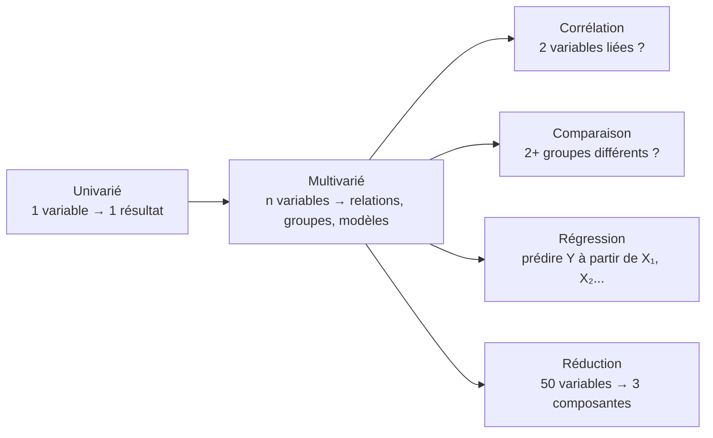

**Règle importante** : fais toujours l'analyse univariée d'abord. Si tu ne comprends pas chaque variable isolément (distribution, outliers, normalité), ton analyse multivariée sera construite sur du sable.

---

## 2. Étape 1 — Décrire plusieurs variables

### Le centroïde (`mean`)

En univarié, la moyenne est un point sur une droite.
En multivarié, la moyenne est un **vecteur** — un point dans un espace à n dimensions.

```
Univarié  : moyenne du revenu = 45 000€         → un nombre
Multivarié : (revenu=45k, ancienneté=3.2, age=34) → un point dans l'espace 3D
```

C'est le **centre de gravité** de ton nuage de données.

### Le résumé croisé (`cross_summary`)

L'équivalent multivarié du `summary()` univarié. Un tableau avec count, mean, std, min, max, quartiles pour chaque variable d'un coup.

Premier réflexe sur un nouveau dataset : `cross_summary(df)` pour repérer les échelles, les valeurs manquantes, les distributions suspectes.

### La matrice de corrélation (`correlation_matrix`)

Le cœur de l'analyse multivariée descriptive. Un tableau carré qui montre la corrélation entre chaque paire de variables.

```
             revenue   users   sessions
revenue      1.00      0.85    0.72
users        0.85      1.00    0.91
sessions     0.72      0.91    1.00
```

Lecture : revenue et users sont fortement corrélés (0.85). Users et sessions encore plus (0.91).

### La matrice de covariance (`covariance_matrix`)

Comme la corrélation mais non normalisée — les valeurs dépendent de l'échelle des variables. Rarement lue directement, mais c'est la brique de base de nombreuses méthodes (PCA, Mahalanobis, Hotelling T²).

| Concept | Analogie univariée | Version multivariée |
|---|---|---|
| Centre | mean → un nombre | mean → un vecteur |
| Dispersion | variance → un nombre | matrice de covariance → un tableau |
| Relation | (n'existe pas) | corrélation → un coefficient par paire |

---

## 3. Étape 2 — Mesurer les relations (corrélation)

### Les trois types de corrélation

#### Pearson (`pearson`)

Mesure la force de la relation **linéaire** entre deux variables.

```
r = +1 : relation linéaire parfaite positive (quand X monte, Y monte proportionnellement)
r =  0 : aucune relation linéaire
r = -1 : relation linéaire parfaite négative (quand X monte, Y descend proportionnellement)
```

**Piège** : Pearson ne voit que les relations linéaires. Si Y = X², Pearson peut donner r ≈ 0 alors que la relation est parfaite.

#### Spearman (`spearman`)

Mesure la force de la relation **monotone** (pas forcément linéaire). Travaille sur les rangs.

```
Si X augmente, Y augmente toujours (même si pas proportionnellement) → Spearman élevé
```

Préfère Spearman quand :
- La relation est monotone mais pas linéaire (ex: rendements décroissants)
- Les données sont ordinales (ratings, classements)
- Il y a des outliers

#### Kendall (`kendall`)

Autre corrélation de rang, plus robuste que Spearman pour les petits échantillons et les données avec beaucoup d'ex-aequo. Plus lent sur de grands datasets.

### Quand utiliser quelle corrélation ?

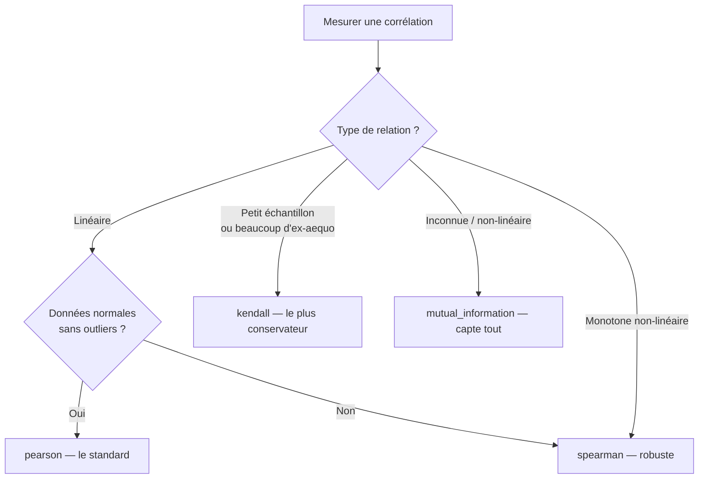

### Corrélation partielle (`partial_correlation`)

La corrélation régulière entre les ventes de glaces et les noyades est forte (~0.8). Mais les deux sont causées par la chaleur. La corrélation partielle contrôle la température et révèle que la relation directe glaces→noyades est quasi nulle.

```
Corrélation brute      : glaces ↔ noyades = 0.80  ← trompeur
Corrélation partielle  : glaces ↔ noyades | température = 0.02  ← réalité
```

**Règle** : si tu soupçonnes qu'une troisième variable explique la relation, utilise la corrélation partielle.

### Point-biserial (`point_biserial`)

Cas spécial : corrélation entre une variable binaire (0/1) et une variable continue.

```
Exemple : corrélation entre genre (H/F) et salaire
→ point_biserial(genre_binaire, salaire)
```

C'est mathématiquement équivalent à un t-test, mais exprimé comme une corrélation.

### Pour les variables catégorielles

Pearson, Spearman et Kendall ne marchent que sur des données numériques. Pour deux variables catégorielles :

| Outil | Usage |
|---|---|
| `chi2_independence` | Test : les deux variables sont-elles liées ? (p-value) |
| `cramers_v` | Force de l'association (0 à 1) |

```
Exemple : "Y a-t-il un lien entre le plan d'abonnement et le churn ?"
→ chi2_independence(df, "plan", "churned")  → p-value
→ cramers_v(df, "plan", "churned")         → force du lien
```

### Information mutuelle (`mutual_information`)

Capte **n'importe quel type** de relation (linéaire, non-linéaire, non-monotone). C'est le détecteur le plus général. Si la mutual information est à 0, les variables sont indépendantes. Plus c'est élevé, plus elles partagent de l'information.

**Inconvénient** : pas de borne supérieure fixe, donc difficile à interpréter en absolu. Surtout utile pour comparer : "X1 est plus informative que X2 pour prédire Y".

---

## 4. Étape 3 — Comparer des groupes

### Le workflow de comparaison

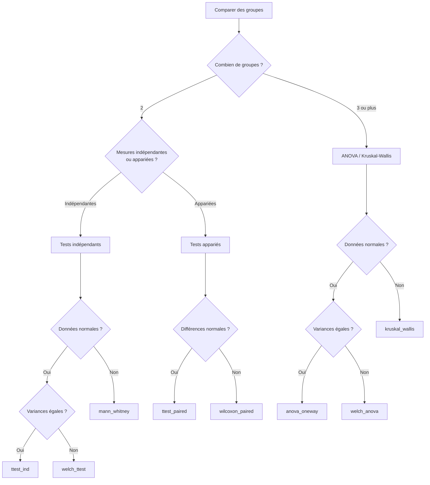

### Comparer deux groupes

#### Indépendants vs appariés

| Type | Signification | Exemple |
|---|---|---|
| **Indépendant** | Deux groupes distincts de sujets | Plan A vs Plan B, hommes vs femmes |
| **Apparié** | Même sujets mesurés deux fois | Avant/après traitement, lundi vs vendredi |

C'est une distinction cruciale — utiliser le mauvais test gaspille de la puissance statistique ou produit des résultats faux.

#### Le t-test indépendant (`ttest_ind`)

La question : "Les moyennes de deux groupes sont-elles significativement différentes ?"

```
Groupe A (plan basic)   : revenus = [20, 25, 30, 22, 28]  → mean = 25
Groupe B (plan premium)  : revenus = [35, 40, 38, 42, 37]  → mean = 38.4

ttest_ind → p = 0.001 → les moyennes sont significativement différentes
```

**Avant de lancer un t-test**, vérifie :

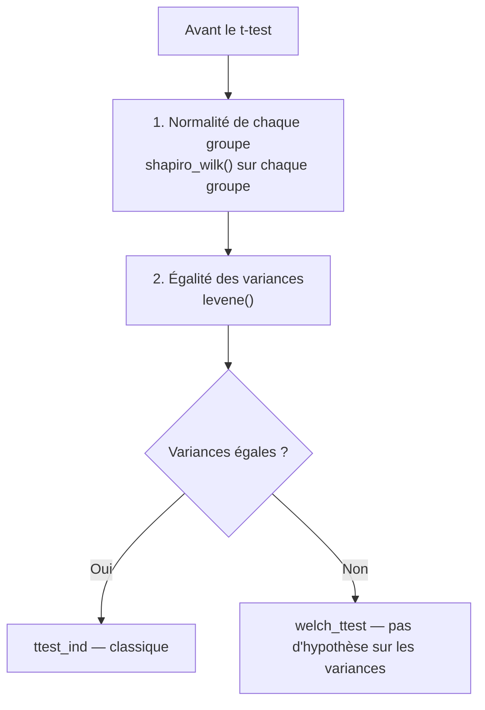

#### Le Welch t-test (`welch_ttest`)

En pratique, **utilise toujours Welch**. Il performe aussi bien que le t-test classique quand les variances sont égales, et mieux quand elles ne le sont pas. C'est le choix sûr par défaut.

#### Mann-Whitney (`mann_whitney`)

L'alternative non-paramétrique au t-test. Ne compare pas les moyennes mais les distributions entières via les rangs.

| Test | Suppose normalité | Suppose égalité des variances | Puissance |
|---|---|---|---|
| `ttest_ind` | Oui | Oui | La plus haute |
| `welch_ttest` | Oui | Non | Haute |
| `mann_whitney` | Non | Non | Moyenne |

#### Tests appariés

| Test | Hypothèse | Usage |
|---|---|---|
| `ttest_paired` | Différences normales | Avant/après, même sujets |
| `wilcoxon_paired` | Aucune | Même chose, données non normales |

#### KS deux échantillons (`kolmogorov_smirnov_2samp`)

Différent des t-tests — ne compare pas les moyennes mais les **distributions entières**. Deux groupes peuvent avoir la même moyenne mais des formes complètement différentes. Le KS détecte ça.

```
Groupe A : [10, 10, 10, 10, 10]  → mean=10, très concentré
Groupe B : [2, 5, 10, 15, 18]   → mean=10, très dispersé

t-test → p élevé (mêmes moyennes)
KS     → p bas (distributions très différentes)
```

#### Vérifier l'égalité des variances

| Test | Hypothèse | Quand l'utiliser |
|---|---|---|
| `levene` | Aucune | Par défaut, robuste |
| `bartlett` | Normalité | Seulement si tu as confirmé la normalité |

### Comparer trois groupes ou plus

#### ANOVA (`anova_oneway`)

La généralisation du t-test à k groupes. Teste si au moins un groupe a une moyenne différente.

```
Groupe A : mean = 25
Groupe B : mean = 30
Groupe C : mean = 45

ANOVA → p = 0.003 → "au moins un groupe diffère"
```

**ANOVA ne dit PAS lequel.** Il faut un test post-hoc pour le savoir.

#### Le workflow ANOVA complet

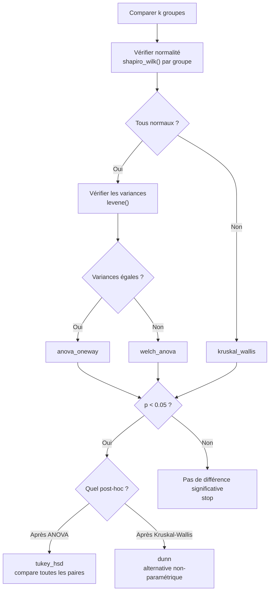

#### Tests post-hoc

ANOVA dit "il y a une différence". Les post-hoc disent "entre qui".

**Tukey HSD** (`tukey_hsd`) — compare toutes les paires de groupes après une ANOVA. Contrôle le risque d'erreur global (pas de problème de comparaisons multiples).

**Dunn** (`dunn`) — même chose après un Kruskal-Wallis. Utilise la correction de Bonferroni.

#### Friedman (`friedman`)

L'ANOVA non-paramétrique pour mesures répétées. Même sujets testés sous k conditions.

```
Exemple : 20 utilisateurs testent 3 interfaces, notent chacune de 1 à 10
→ friedman([notes_interface_A, notes_interface_B, notes_interface_C])
```

### Tailles d'effet pour les comparaisons

La p-value dit "il y a une différence". La taille d'effet dit "elle est grande comment".

#### Deux groupes

| Mesure | Associée à | Interprétation |
|---|---|---|
| `cohens_d_2samp` | t-test | 0.2 petit, 0.5 moyen, 0.8 grand |
| `rank_biserial` | Mann-Whitney | 0.1 petit, 0.3 moyen, 0.5 grand |

#### K groupes

| Mesure | Associée à | Signification |
|---|---|---|
| `eta_squared` | ANOVA | % de variance expliquée par le groupement |
| `omega_squared` | ANOVA | Même chose, moins biaisé |

Interprétation de η² et ω² :

| Valeur | Effet |
|---|---|
| ≈ 0.01 | Petit |
| ≈ 0.06 | Moyen |
| ≈ 0.14 | Grand |

---

## 5. Étape 4 — Modéliser (régression)

### Qu'est-ce que la régression ?

La régression modélise la relation entre une variable cible (Y) et une ou plusieurs variables explicatives (X). En univarié, tu décris. En régression, tu **prédis et expliques**.

```
"Le loyer dépend-il de la surface, du quartier et de l'étage ?"

loyer = β₀ + β₁×surface + β₂×quartier + β₃×étage + erreur
```

### OLS — Régression linéaire ordinaire (`ols`)

Le modèle de base. Trouve la droite (ou l'hyperplan) qui minimise la somme des erreurs au carré.

**Lecture des résultats** :

| Élément | Signification |
|---|---|
| **Coefficients (β)** | L'effet de chaque variable. β₁ = 50 signifie "+50€ de loyer par m² supplémentaire" |
| **p-value par coefficient** | Ce coefficient est-il significativement ≠ 0 ? Si p < 0.05, la variable a un effet. |
| **R²** | Proportion de la variance de Y expliquée par le modèle. 0 = rien, 1 = tout. |
| **R² ajusté** | R² corrigé pour le nombre de variables. Préfère-le au R² brut. |
| **F-statistic** | Le modèle global est-il significatif ? (au moins une variable a un effet) |
| **AIC / BIC** | Critères de comparaison entre modèles. Plus bas = meilleur. |

### Avant la régression : vérifier la multicolinéarité (`vif`)

Si deux variables sont très corrélées (ex: surface en m² et nombre de pièces), les coefficients deviennent instables et ininterprétables.

| VIF | Interprétation |
|---|---|
| 1 | Pas de multicolinéarité |
| 1-5 | Modérée, acceptable |
| 5-10 | Élevée, à surveiller |
| > 10 | Sévère, cette variable est redondante |

**Solutions quand le VIF est élevé** :
- Supprimer une des variables corrélées
- Les combiner (PCA)
- Utiliser ridge() qui tolère la multicolinéarité

### Après la régression : diagnostic des résidus (`residual_diagnostics`)

Les résidus = la différence entre les valeurs observées et les valeurs prédites. Pour que le modèle soit valide, les résidus doivent être :

| Propriété | Test | Ce qu'on vérifie |
|---|---|---|
| Normaux | Shapiro-Wilk | Les erreurs sont aléatoires et symétriques |
| Homoscédastiques | Breusch-Pagan | La variance des erreurs est constante |
| Non autocorrélés | Durbin-Watson | Les erreurs ne suivent pas un pattern temporel |

Si les diagnostics échouent, le modèle est peut-être mal spécifié (relation non-linéaire, variable manquante, outliers influents).

### Le workflow complet de la régression

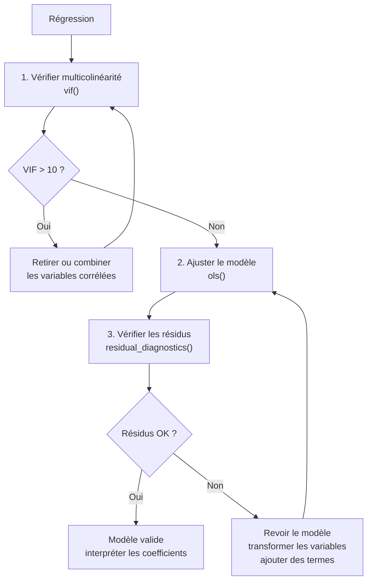

### Régression logistique (`logistic`)

Quand la cible est binaire (oui/non, churn/pas churn, clic/pas clic).

```
P(churn) = f(ancienneté, montant_mensuel, nb_appels_support)
```

**Lecture des résultats** :

| Élément | Signification |
|---|---|
| **Coefficients** | En log-odds (pas directement interprétable) |
| **Odds ratios** | exp(coefficient). OR = 1.5 signifie "50% plus de chances" |
| **Pseudo R²** | Analogue du R² pour la logistique. Plus modeste (0.2-0.4 = bon modèle) |

### Ridge et Lasso — régression régularisée

Pour les situations où OLS ne suffit pas.

| Méthode | Pénalité | Effet | Quand l'utiliser |
|---|---|---|---|
| `ridge` | L2 (somme des β²) | Réduit tous les coefficients | Multicolinéarité, beaucoup de variables |
| `lasso` | L1 (somme des \|β\|) | Met certains coefficients à zéro | Sélection de variables automatique |

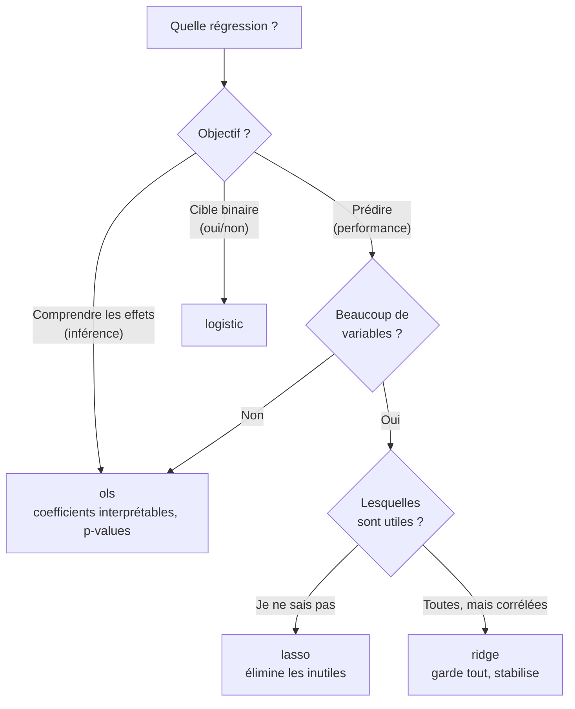

---

## 6. Étape 5 — Réduire la dimension (PCA)

### Le problème

Tu as 50 variables. C'est impossible à visualiser, lent à modéliser, et beaucoup de variables sont probablement corrélées (donc redondantes).

### L'idée de la PCA

La PCA trouve de **nouveaux axes** (composantes principales) qui capturent le maximum de variance en un minimum de dimensions.

```
50 variables originales → PCA → 3 composantes qui capturent 85% de l'information
```

Chaque composante est une **combinaison linéaire** des variables originales. La première composante capture le plus de variance, la deuxième le plus de variance restante (perpendiculaire à la première), etc.

### Lire les résultats

#### Variance expliquée

```
PC1 : 45% de la variance
PC2 : 25% de la variance
PC3 : 12% de la variance
──────────────────────────
Total : 82% avec 3 composantes (au lieu de 50 variables)
```

#### Loadings

Les loadings disent combien chaque variable originale contribue à chaque composante.

```
         PC1     PC2
revenue  0.85    0.12    ← revenue domine PC1
users    0.82    0.15    ← users aussi → PC1 = "taille du business"
churn   -0.10    0.90    ← churn domine PC2 → PC2 = "santé client"
```

#### Scores

Les coordonnées de chaque observation dans le nouvel espace. Utilise-les pour visualiser les données en 2D ou 3D.

### Combien de composantes garder ? (`scree_data`)

Trois règles :

| Règle | Principe |
|---|---|
| **Kaiser** | Garder les composantes avec eigenvalue > 1 |
| **Coude** | Garder les composantes avant le "coude" du scree plot |
| **Seuil cumulatif** | Garder assez pour atteindre 80-90% de variance cumulée |

**Important** : toujours standardiser les variables avant la PCA. Sinon une variable en millions (revenu) dominera une variable en unités (note de 1 à 5). La fonction `pca()` le fait automatiquement.

---

## 7. Étape 6 — Tests multivariés avancés

### Hotelling T² (`hotelling_t2`)

Le t-test multivarié. Compare deux groupes sur **plusieurs variables simultanément**.

```
Univarié : "Les hommes ont-ils un revenu différent ?"              → t-test
Multivarié : "Les hommes diffèrent-ils en revenu ET âge ET ancienneté ?" → Hotelling T²
```

Pourquoi ne pas faire 3 t-tests séparés ?
- Problème des comparaisons multiples (risque de faux positif augmente)
- Les t-tests ignorent les corrélations entre variables
- Un pattern peut émerger dans l'espace multivarié sans être visible variable par variable

### Distance de Mahalanobis (`mahalanobis`)

Détection d'outliers multivariés. Un point peut sembler normal sur chaque variable isolément, mais être aberrant quand on regarde toutes les variables ensemble.

```
Exemple :
  Taille = 180cm → normal
  Poids  = 55kg  → normal
  Mais taille=180 ET poids=55 ensemble → inhabituel (très mince pour cette taille)
  → Distance de Mahalanobis élevée
```

La Mahalanobis tient compte des corrélations entre variables, contrairement à la distance euclidienne classique.

### Box M (`box_m`)

Vérifie si les matrices de covariance sont égales entre groupes. C'est une hypothèse de Hotelling T².

**Attention** : Box M est très sensible — il rejette souvent avec de grands échantillons même quand les différences sont négligeables. Considère-le comme un signal d'alerte, pas un verdict définitif.

---

## 8. Arbre de décision — Quel outil utiliser ?

### "Je veux explorer les relations entre variables"

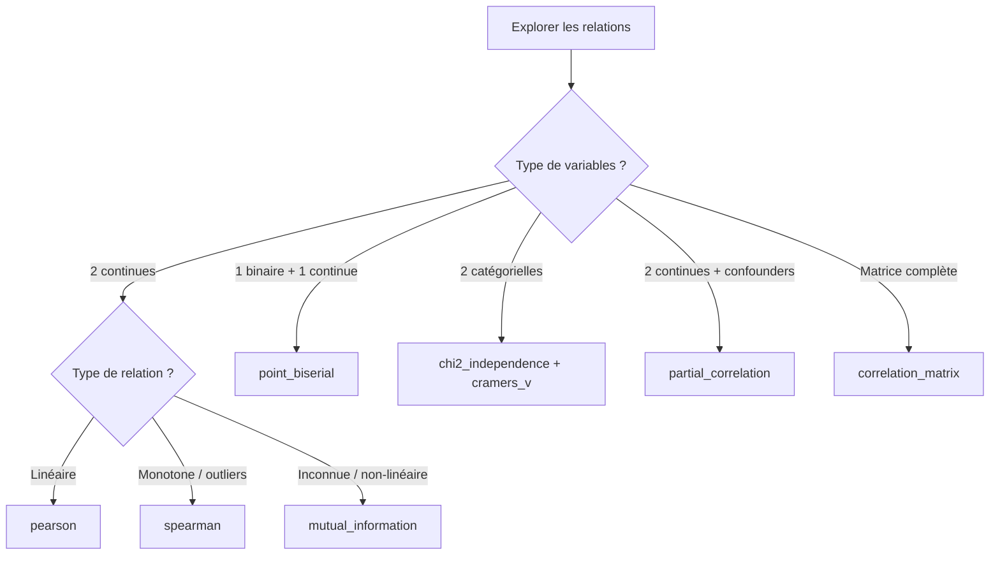

### "Je veux comparer des groupes"

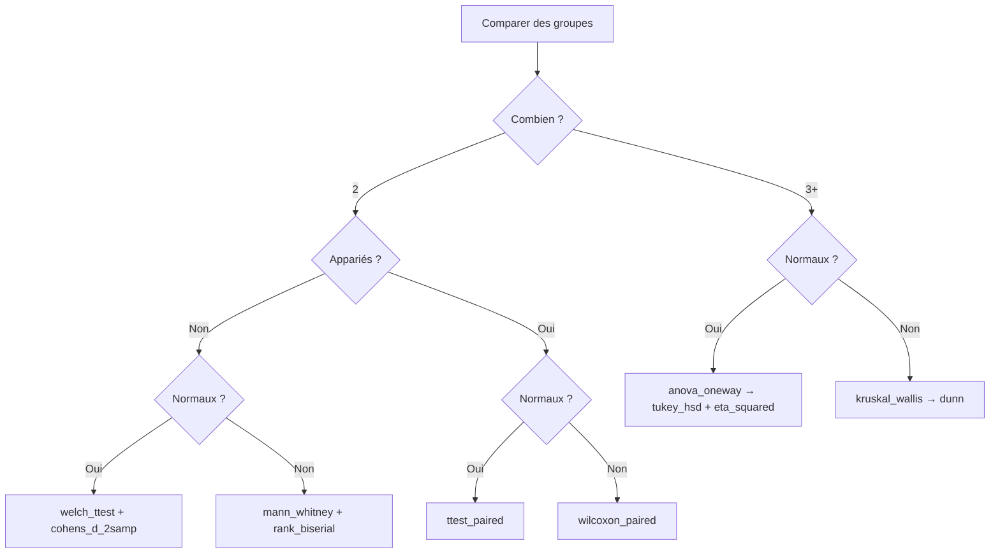

### "Je veux prédire / modéliser"

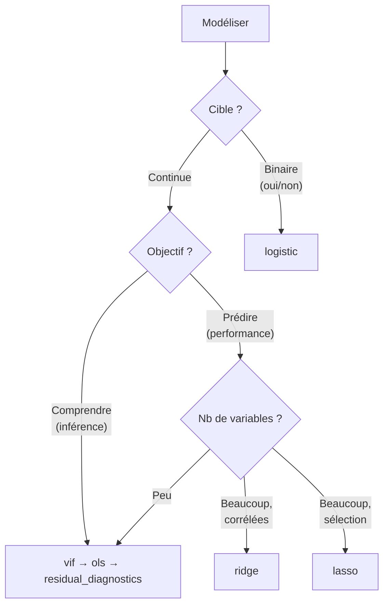

### "Je veux réduire la dimensionnalité"

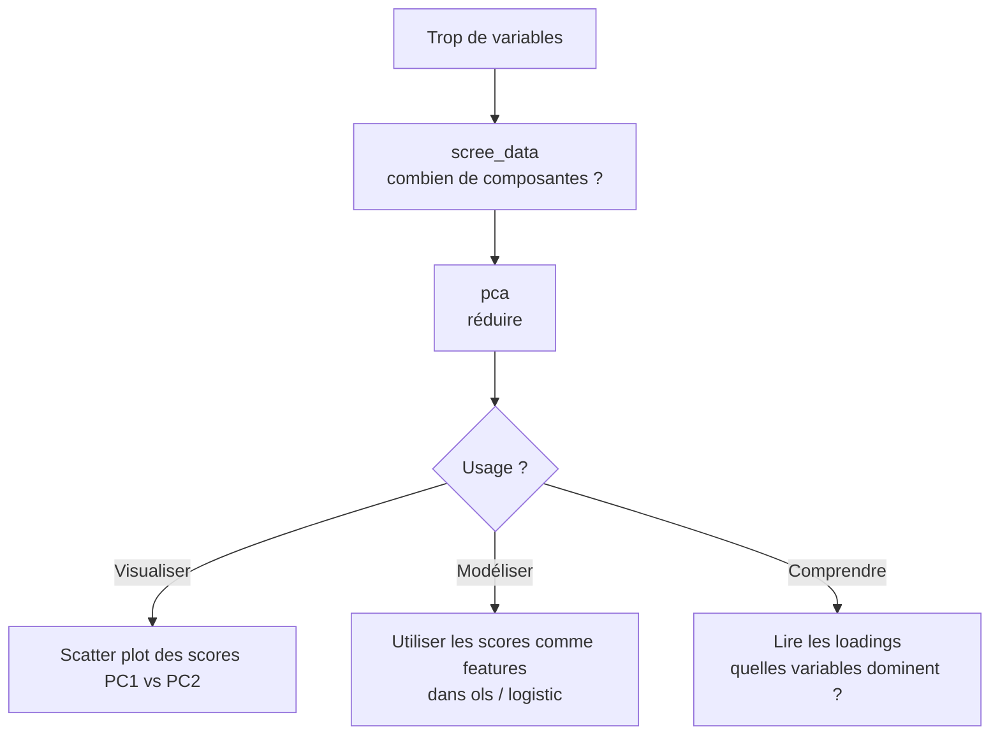

---

## 9. Les pièges classiques

### Corrélation ≠ Causalité

Le piège le plus connu mais toujours le plus fréquent.

```
Corrélation forte entre ventes de lunettes de soleil et noyades
→ Les lunettes ne causent pas les noyades
→ Variable cachée : la température
```

**Solution** : corrélation partielle, régression avec contrôle, ou idéalement un design expérimental (A/B test).

### Comparaisons multiples

Si tu fais 20 t-tests à α = 0.05, tu as environ 64% de chances d'avoir au moins un faux positif, même s'il n'y a aucun vrai effet.

```
P(au moins 1 faux positif) = 1 - (0.95)²⁰ = 0.64
```

**Solution** : utilise `tukey_hsd()` ou `dunn()` qui corrigent pour les comparaisons multiples. Ne fais jamais une série de t-tests entre paires de groupes.

### Le paradoxe de Simpson

Une tendance visible dans les données globales peut s'inverser quand on sépare par sous-groupes.

```
Global       : traitement A est meilleur que B
Par hôpital  : dans CHAQUE hôpital, B est meilleur que A
Explication  : l'hôpital qui utilise A reçoit les cas les plus légers
```

**Solution** : toujours segmenter par les variables confondantes potentielles avant de conclure.

### Overfitting en régression

Plus tu ajoutes de variables, plus le R² monte — même si les variables n'ont aucun pouvoir prédictif réel. Avec assez de variables, tu peux "expliquer" du bruit.

**Solutions** :
- Regarder le R² ajusté (pénalise les variables inutiles)
- Utiliser AIC/BIC pour comparer les modèles
- Utiliser lasso (élimine les variables inutiles)
- Valider sur des données non vues (train/test split)

### Multicolinéarité silencieuse

Deux variables corrélées à 0.95 rendent les coefficients individuels ininterprétables, même si le modèle global est bon.

```
ols résultat : surface_m2 p=0.45, nb_pieces p=0.62
→ "Aucune variable n'est significative ???"
→ En fait les deux mesurent la même chose (taille du logement)
→ Séparément, chacune est significative
```

**Solution** : vérifier `vif()` avant toute régression.

---

## 10. Glossaire multivarié

| Terme | Définition |
|---|---|
| **ANOVA** | Analysis of Variance. Compare les moyennes de 3+ groupes. |
| **Centroïde** | Le point moyen d'un nuage de données multidimensionnel. Vecteur des moyennes. |
| **Composante principale** | Nouvel axe trouvé par la PCA, combinaison linéaire des variables originales. |
| **Contingence (table de)** | Tableau croisé des fréquences entre deux variables catégorielles. |
| **Corrélation partielle** | Corrélation entre deux variables après avoir retiré l'effet d'autres variables. |
| **Cramér's V** | Mesure de force d'association entre deux variables catégorielles. 0 à 1. |
| **Durbin-Watson** | Test d'autocorrélation des résidus. Valeur idéale ≈ 2. |
| **Eigenvalue** | Valeur propre. En PCA, quantifie la variance capturée par une composante. |
| **Eta squared (η²)** | Proportion de variance expliquée par le groupement dans une ANOVA. |
| **F-statistic** | Ratio entre variance inter-groupes et variance intra-groupes. |
| **Homoscédasticité** | Les résidus ont une variance constante. Hypothèse de la régression. |
| **Hotelling T²** | T-test multivarié. Compare deux groupes sur plusieurs variables. |
| **Information mutuelle** | Mesure de dépendance générale (linéaire et non-linéaire). |
| **Loadings** | Poids de chaque variable originale dans une composante PCA. |
| **Log-odds** | Logarithme du rapport de chances. Unité naturelle de la régression logistique. |
| **Mahalanobis** | Distance tenant compte des corrélations. Pour la détection d'outliers multivariés. |
| **Matrice de covariance** | Version non normalisée de la matrice de corrélation. |
| **Multicolinéarité** | Variables explicatives fortement corrélées entre elles. |
| **Odds ratio** | Rapport de chances. OR=2 → deux fois plus probable. |
| **Omega squared (ω²)** | Version moins biaisée de eta squared. |
| **Overfitting** | Le modèle apprend le bruit, pas le signal. Bon en entraînement, mauvais en prédiction. |
| **PCA** | Principal Component Analysis. Réduit la dimensionnalité en trouvant de nouveaux axes. |
| **Post-hoc** | Test effectué après ANOVA pour identifier quels groupes diffèrent. |
| **Rank-biserial** | Taille d'effet pour Mann-Whitney. -1 à +1. |
| **Régularisation** | Pénalité sur les coefficients pour éviter l'overfitting (ridge, lasso). |
| **Résidus** | Différence entre valeurs observées et prédites. |
| **R²** | Proportion de variance de Y expliquée par le modèle. 0 à 1. |
| **Scree plot** | Graphique des eigenvalues pour choisir le nombre de composantes PCA. |
| **Simpson (paradoxe de)** | Une tendance s'inverse quand on sépare par sous-groupes. |
| **VIF** | Variance Inflation Factor. Détecte la multicolinéarité. > 10 = problème. |

---

*Ce guide accompagne la lib `polars_stats`. Pour la doc technique de chaque fonction, voir les docstrings dans le code source.*